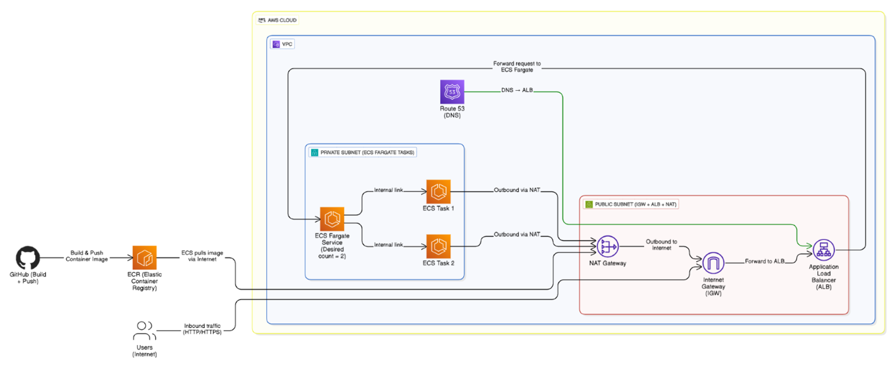
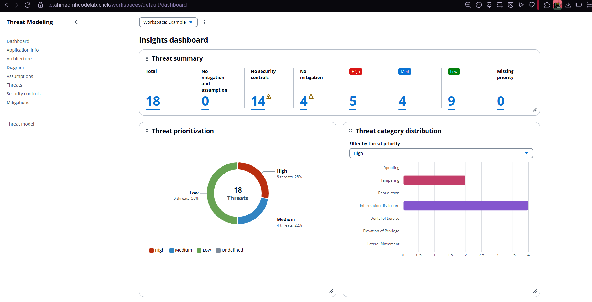

# Threat Composer on ECS

## 📋 Project Overview

This repository contains my implementation of Amazon's Threat Composer Tool hosted on AWS ECS using Terraform infrastructure as code. The project demonstrates a complete DevOps workflow with containerization, infrastructure provisioning, CI/CD, and security best practices.

### �️ Architecture Diagram



### Application Screenshots

<div align="center">

<table>
<tr>
<td align="center" width="50%">

<br/>
<strong>Insights Dashboard</strong>
<br/>
<em>Threat prioritization and category distribution</em>
</td>
<td align="center" width="50%">

<br/>
<strong>Threat Modeling Interface</strong>
<br/>
<em>Interactive threat modeling workspace</em>
</td>
</tr>
<tr>
<td align="center" width="50%">

<br/>
<strong>Data Flow Diagram</strong>
<br/>
<em>Visual threat modeling with diagram editor</em>
</td>
<td align="center" width="50%">

<br/>
<strong>Application Features</strong>
<br/>
<em>Comprehensive threat analysis tools</em>
</td>
</tr>
</table>

</div>

### Live Demo

Visit the live application: [https://threatcomposer.ahmedmhcodelab.click/](https://threatcomposer.ahmedmhcodelab.click/)

The infrastructure consists of:

- **Network Layer**
  - VPC with public and private subnets across 2 availability zones
  - Internet Gateway for public access
  - NAT Gateways for private subnet egress
  - Security groups with restricted access

- **Container Orchestration**
  - ECS Fargate cluster (serverless container management)
  - Task definitions with proper resource allocation
  - Auto-scaling based on CPU/memory metrics
  - ECR repository for container images

- **Security & Access**
  - Application Load Balancer with HTTPS listener
  - ACM certificate for TLS/SSL
  - Route 53 DNS configuration
  - AWS Secrets Manager for sensitive configuration

- **CI/CD Pipeline**
  - GitHub Actions workflows for automation
  - Container building and security scanning
  - Terraform validation and deployment
  - Zero-downtime deployment strategy

## Local Development

### Prerequisites

- Node.js and Yarn
- Docker
- AWS CLI
- Terraform 1.0+

### Running Locally

1. Clone the repository:
   ```bash
   git clone https://github.com/AhmedMHCodeLab/ECS-Project-V1.git
   cd ECS-Project-V1/app
   ```

2. Install dependencies and build:
   ```bash
   yarn install
   yarn build
   ```

3. Run the application:
   ```bash
   yarn global add serve
   serve -s build
   ```

4. Access the application at:
   ```
   http://localhost:3000/workspaces/default/dashboard
   ```

### Building & Testing the Container

```bash
docker build -t threat-composer:local ./app
docker run -p 80:80 threat-composer:local
```

## Infrastructure Deployment

### Prerequisites

- AWS account with appropriate permissions
- Terraform 1.0+
- A registered domain name (for HTTPS)

### Deployment Steps

1. Configure your AWS credentials:
   ```bash
   aws configure
   ```

2. Update domain settings in `infra/terraform.tfvars`:
   ```hcl
   domain_name = "your-domain.com"
   environment = "dev"  # or "prod"
   ```

3. Initialize and apply Terraform:
   ```bash
   cd infra
   terraform init
   terraform apply
   ```

4. After deployment, access your application using the URL in the Terraform outputs.

## 📁 Project Structure

```
.
├── app/
│   ├── Dockerfile
│   ├── nginx.conf
│   ├── package.json
│   ├── babel.config.json
│   ├── tsconfig.json
│   ├── public/
│   │   ├── index.html
│   │   ├── manifest.json
│   │   └── robots.txt
│   └── src/
│       ├── index.tsx
│       ├── components/
│       ├── containers/
│       ├── contexts/
│       ├── hooks/
│       ├── configs/
│       └── utils/
├── infra/
│   ├── main.tf
│   ├── variables.tf
│   ├── outputs.tf
│   ├── locals.tf
│   ├── route53.tf
│   ├── terraform.tfvars
│   └── modules/
│       ├── vpc/
│       ├── sg/
│       ├── ecr/
│       ├── acm/
│       ├── alb/
│       └── ecs/
├── .github/workflows/
│   ├── terraformworkflow.yml
│   ├── manualterraformapply.yml
│   ├── TerraformDestroy.yml
│   └── imagebuildandpush.yml
├
│   screenshots
├── Diagram.png
└── README.md
```


## 🔒 Security Features

- Private subnets for ECS tasks
- Security groups with least privilege
- HTTPS with TLS 1.2+
- Secrets management for sensitive configuration
- Container scanning in CI/CD
- Infrastructure security scanning


## Project Outcomes

- Successfully containerized the Threat Composer application
- Implemented a secure, scalable infrastructure on AWS
- Created automation for both application and infrastructure deployment
- Applied best practices for security, networking, and DevOps

## Future Improvements
- Add CloudFront for content caching and better global performance
- Set up cross-region disaster recovery
- Implement canary deployments for safer releases

## 📚 Resources Used

- [Terraform AWS Registry](https://registry.terraform.io/providers/hashicorp/aws/latest/docs)
- [Terraform AWS ECS](https://registry.terraform.io/providers/hashicorp/aws/latest/docs/resources/ecs_service)
- [Terraform Documentation](https://www.terraform.io/docs/index.html)
- [ECS Documentation](https://docs.aws.amazon.com/ecs/index.html)
- [Threat Composer Documentation](https://github.com/awslabs/threat-composer)

---

Developed by [AhmedMHCodeLab](https://github.com/AhmedMHCodeLab) 
