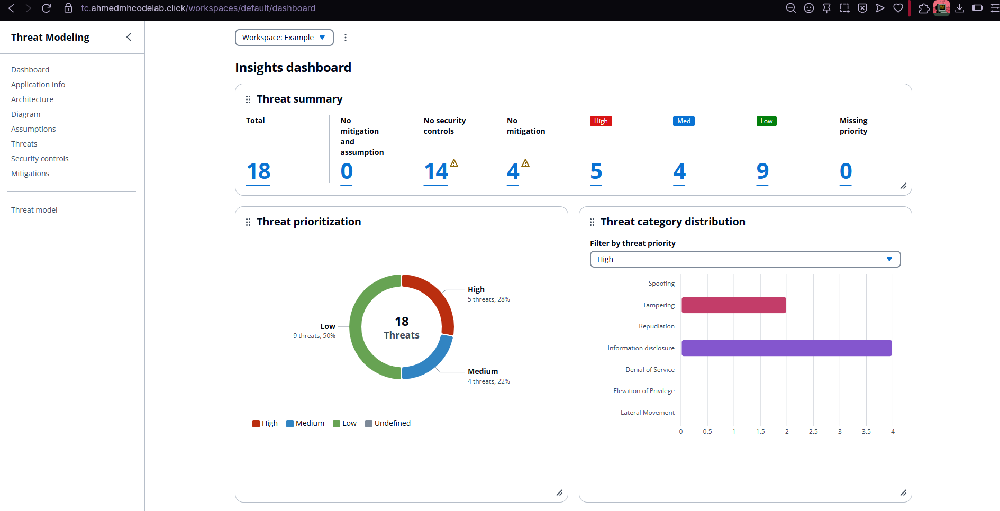

# Threat Composer on ECS

Production deployment of AWS's Threat Composer using ECS Fargate, fully automated with Terraform and GitHub Actions.

**Live instance:** [tc.ahmedmhcodelab.click](https://tc.ahmedmhcodelab.click/)

.png)

## What This Is

Threat Composer is AWS's open-source threat modeling tool. This repo contains the infrastructure and deployment automation to run it on ECS Fargate with proper networking, HTTPS termination, and CI/CD.

The setup uses:
- Multi-AZ VPC with public/private subnet isolation
- ECS Fargate for container orchestration
- ALB with ACM-managed certificates
- Route53 for DNS management
- GitHub Actions for build and deployment automation


## Infrastructure

The Terraform configuration provisions:

**Networking**
- VPC spanning 2 availability zones
- Public subnets for load balancers
- Private subnets for ECS tasks
- NAT gateways for private subnet internet access

**Compute**
- ECS Fargate cluster running the containerized React app
- Auto-scaling based on CPU and memory utilization
- Task definitions with configurable resource limits

**Load Balancing & DNS**
- Application Load Balancer with HTTPS listener (TLS 1.2+)
- ACM certificate for SSL/TLS
- Route53 hosted zone and DNS records

**Container Registry**
- ECR repository for storing built images
- Image scanning enabled

## Screenshots




## Running Locally

Clone and install dependencies:

```bash
git clone https://github.com/AhmedMHCodeLab/ECS-Project-V1.git
cd ECS-Project-V1/app
yarn install
yarn build
```

Serve the build:

```bash
yarn global add serve
serve -s build
```

Access at `http://localhost:3000/workspaces/default/dashboard`

Or run the containerized version:

```bash
docker build -t threat-composer:local ./app
docker run -p 80:80 threat-composer:local
```

## Deploying to AWS

Requirements:
- AWS account with appropriate IAM permissions
- Terraform 1.9.0+
- Registered domain name

Configure AWS credentials:

```bash
aws configure
```

Update `infra/environments/dev/terraform.tfvars`:

```hcl
domain_name = "tc.your-domain.com"
environment = "dev"
project_name = "ecs-threat-composer"
```

Bootstrap the remote state backend:

```bash
cd infra/bootstrap
terraform init
terraform apply
```

Copy the S3 bucket name from the output and update `infra/environments/dev/backend.tf` with the bucket name.

Deploy the infrastructure:

```bash
cd infra/environments/dev
terraform init -migrate-state
terraform apply
```

After Terraform completes, update your domain registrar's nameservers to point to the Route53 hosted zone nameservers shown in the output.

## CI/CD Pipeline

The GitHub Actions workflow handles:
- Docker image builds
- Container vulnerability scanning
- Terraform validation and planning
- Automated deployment to ECS
- Rolling updates with zero downtime

Deployments trigger on pushes to main after all checks pass.

## Security Considerations

- ECS tasks run in private subnets with no direct internet access
- Outbound traffic routes through NAT gateways
- Security groups enforce least-privilege network access
- ALB terminates TLS, tasks communicate over HTTP internally
- Container images scanned for vulnerabilities in CI
- ACM handles certificate lifecycle automatically

## Next Steps

Things I'm considering:
- CloudFront distribution for edge caching and global performance
- Cross-region failover with Route53 health checks
- Blue/green deployments for safer release strategy
- CloudWatch dashboards for observability

## References

- [Threat Composer source](https://github.com/awslabs/threat-composer)
- [Terraform AWS Provider](https://registry.terraform.io/providers/hashicorp/aws/latest/docs)
- [ECS Best Practices](https://docs.aws.amazon.com/AmazonECS/latest/bestpracticesguide/intro.html)

---

Built by [AhmedMHCodeLab](https://github.com/AhmedMHCodeLab)
